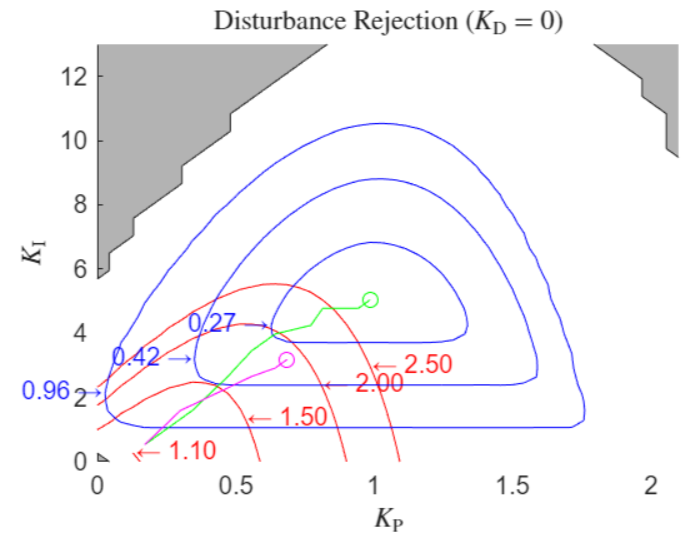

## Name
Garpinger's Trade-Off Diagram Toolbox for PID Control Design

## Description
A MATLAB project implementing Garpinger’s trade-off diagram approach for PID controller tuning and performance analysis. The project provides core functions for trade-off visualization, a live script showcasing a real-world field study, and a detailed explanation of the underlying theory.

## Installation
Download the Package Toolbox and install them on Matlab.
Alternatively, the Matlab project can be opened. The Toolbox will then also be available. 

## Usage
The recommended entry point for using this toolbox is the Live Script ``Getting Started``. After successfully installing the Toolbox, it will open automatically and provide a step-by-step introduction to the Toolbox.

Another option is to open the Levie script ``FieldstudyTradeoff``. This script demonstrates a complete field study conducted on a DC motor. It includes a structured description of the study setup, followed by the application of core functions provided by the toolbox.

The script serves both as a practical example and as a template for adapting the methodology to other systems. It is particularly suitable for users who prefer a guided, interactive approach to exploring the toolbox's capabilities.

All individual functions within the toolbox are documented and can be explored using MATLAB’s built-in help system. To access the documentation for a specific function, use the commands  
``help calculateTradeoff``  
``help calculateCascadedTradeoff``  
``help plotTradeoff``  

## Cite As
Hoher, S. & Rehrl, J., (2025) "Garpinger's Trade-Off Diagram Toolbox for PID Control Design", MATLAB Central File Exchange.  
Hoher, S. & Rehrl, J., (2025) “Analysis and tuning of PID controller gains for DC servo drives using Garpinger’s trade-off plots”, ARW Proceedings 25(1), 19-24. doi: https://doi.org/10.34749/3061-0710.2025.3